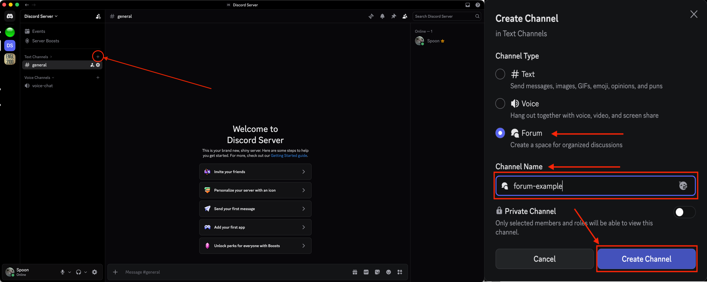
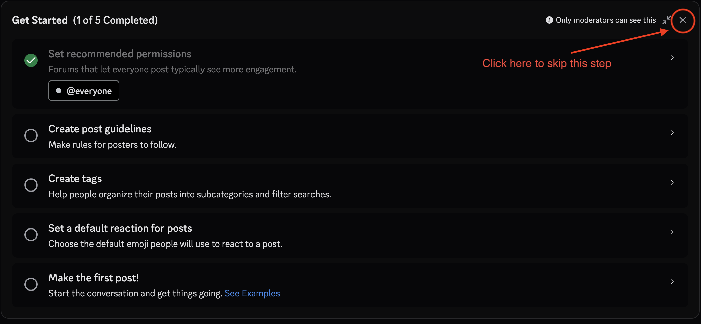
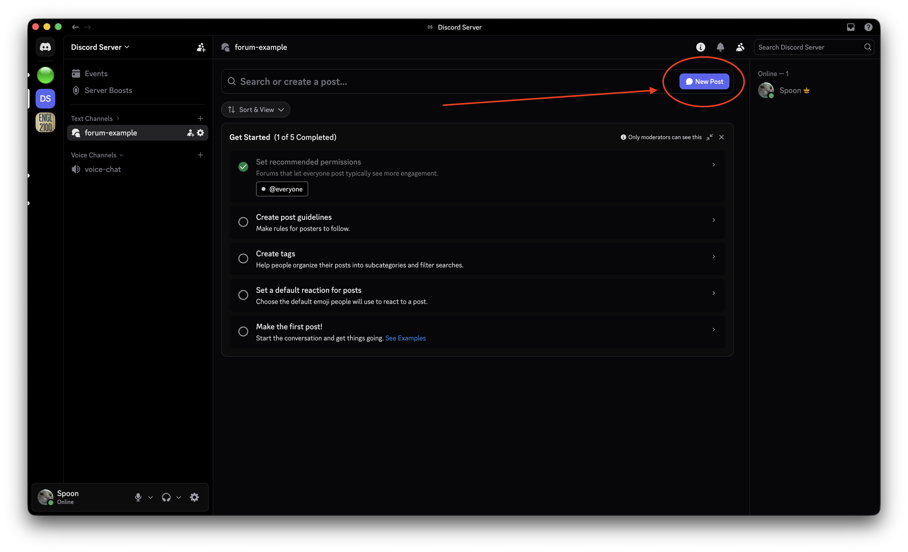
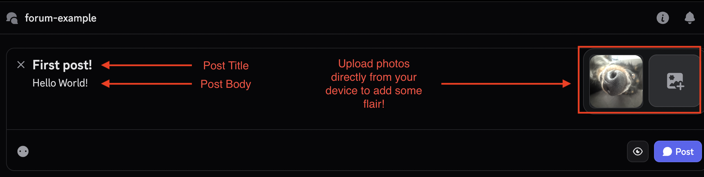
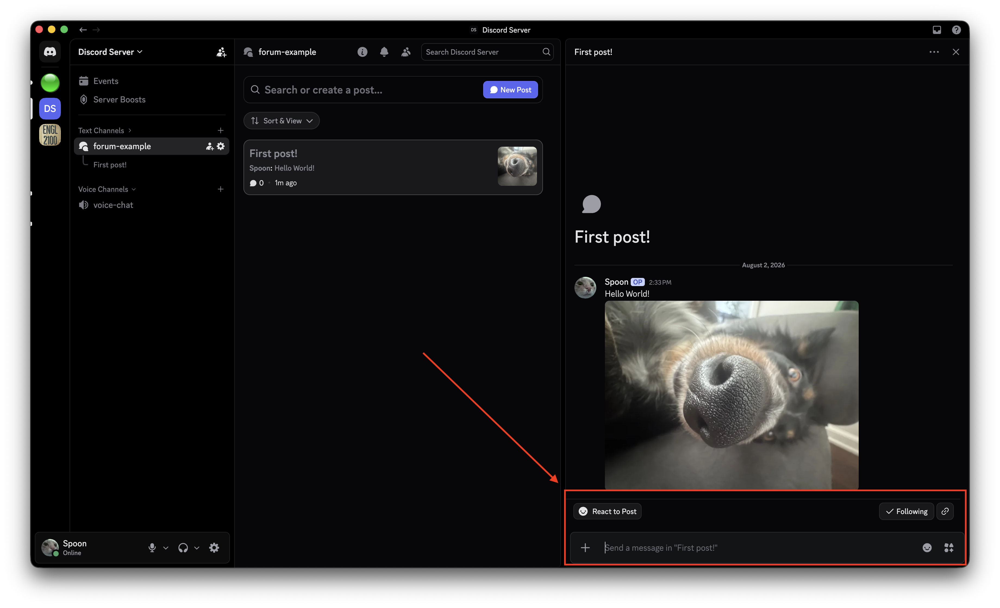

# Tutorial - Forums

### Forums are a perfect solution to discussion boards in Discord!

*Don't have Discord? [Click Here](https://discord.com/download) to download*

## Create a new Text Channel

- Click the **+** on the left side of your screen to add a new channel.
- Select **Forum** and customize the options to fit your server
- Click **Create Channel**!

## Get Started Page (Optional)

Once redirected to your new channel, you will see 5 different options in a list. Click on each one to change the specific setting.

1. Permissions
2. Guidelines/Rules
3. Tags (for filtering)
4. Default Reaction (A selected emoji that will appear on all posts)
5. Make the first post! (Clicking on this will automatically start the process of creating a post)

## Create Your First Post!

Click the 'New Post' button at the top of the page

- Fill out the Title, Body, and Image *(Optional)* with your post info
- Click the **Post** button in the bottom-right!

## Post Responses

- View and click on any post within the forum to respond to others
- Write your reply in the comment box located at the bottom
- *tip: the **op** tag is applied to the author of the post*